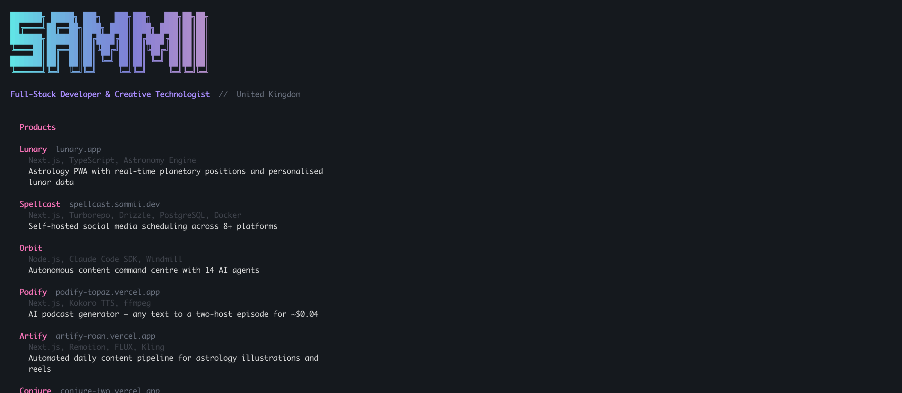

# sammii

A terminal portfolio built with [Ink](https://github.com/vadimdemedes/ink) and React.

```
npx sammii
```



## What it does

Interactive CLI that renders my developer portfolio in the terminal. Browse projects, read the about section, and grab links — all without leaving the command line.

## Built with

- **Ink** — React for CLIs
- **chalk** — terminal styling
- **ink-gradient** — gradient text rendering
- **ink-select-input** — arrow key navigation

## Run locally

```bash
git clone https://github.com/sammii-hk/sammii-cli.git
cd sammii-cli
npm install
node bin/cli.js
```
